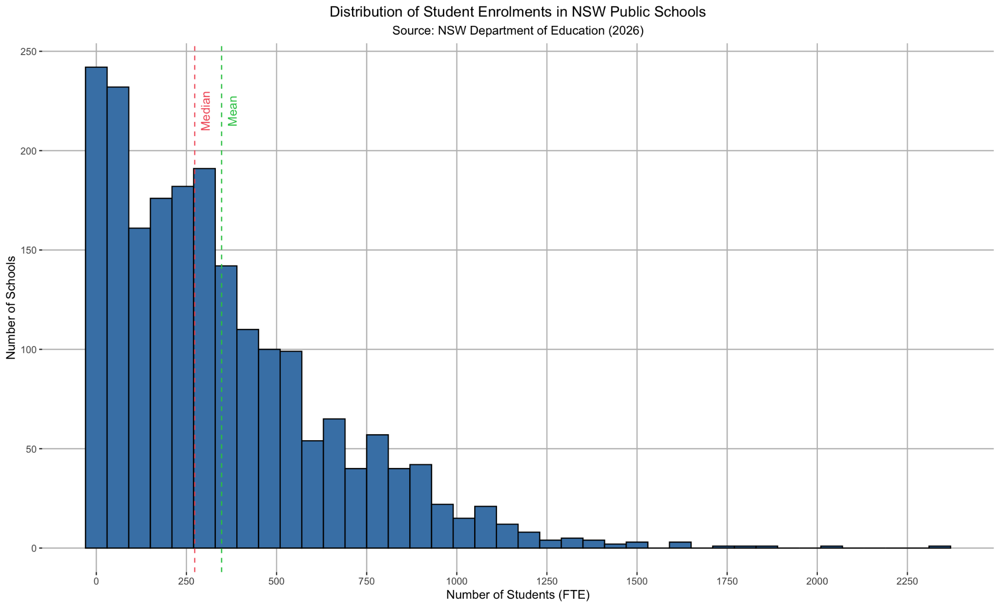
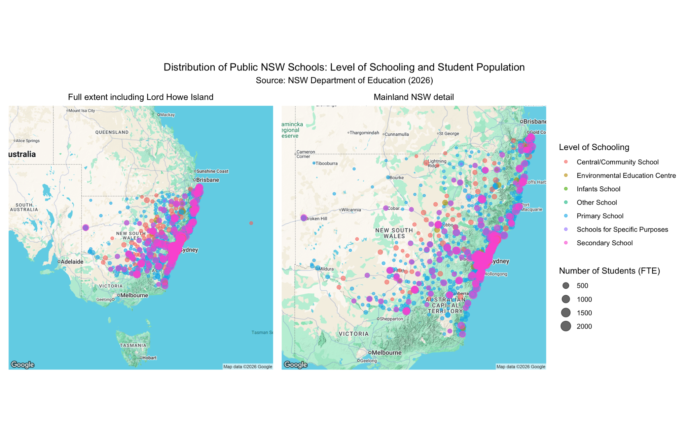
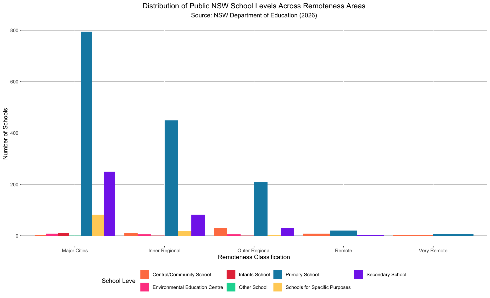
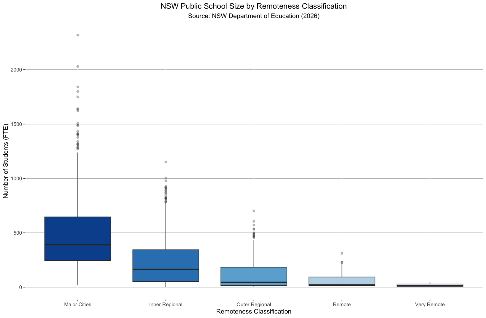
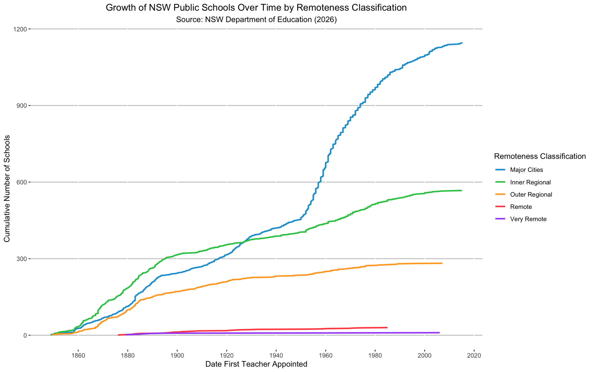

# NSW Public School Enrolments and Distribution: A Visual Analysis

A data visualisation project analysing the size, geographic distribution, remoteness profile, and historical growth of the New South Wales government school network. Built in **R** with the **tidyverse** and **ggplot2**, using the NSW Department of Education master dataset of every public school in the state.

The work covers the full pipeline: importing and cleaning a wide, messy government dataset, handling suppressed and missing values, then producing five matched visualisations that each answer a distinct question about the network.

> Completed for BUSA8090 (Data and Visualisation for Business), Master of Business Analytics, Macquarie University.

## Key findings

- **School size is strongly right-skewed.** Most schools enrol fewer than 400 FTE students, with a long thin tail past 2,000, so the median is the honest summary of a typical school rather than the mean.
- **A consistent remoteness gradient governs the network.** Both the number of schools and their typical size fall in step as remoteness increases, leaving Major Cities dominant on every measure and Very Remote areas sparsely served.
- **Metropolitan growth is a post-war story.** Inner regional areas were schooled first and led through the nineteenth century, before the Major Cities curve overtook them around the 1920s and surged through mid-century, consistent with Sydney's suburban expansion.

## Skills demonstrated

For data analyst intern roles, this project evidences:

- **Data cleaning and wrangling**: profiling a wide (50+ column) government dataset, type conversion, factor handling, and deduplication with `dplyr`.
- **Missing and suppressed data**: recognising privacy suppression (`np`) versus true nulls, and choosing median imputation appropriate to a skewed distribution rather than a default mean.
- **Statistical literacy**: reading distribution shape, skew, central tendency, spread, and outliers, and reasoning about which summary statistic is honest to report.
- **Data visualisation**: matching chart type to question and applying sound encoding principles (common baselines, zero-based axes, category-distinct palettes).
- **Geospatial analysis**: plotting coordinate data over basemap tiles with `ggmap`, `ozmaps`, and `sf`.
- **Communicating insight**: translating each chart into a clear, decision-relevant finding for a non-technical audience.
- **Reproducibility and good practice**: a single runnable script, secrets kept out of version control, and a documented setup.

## Visualisations

### 1. Distribution of student enrolments
A histogram with median and mean reference lines, revealing the right-skew that makes the median the appropriate benchmark for funding and reporting.



### 2. Geographic distribution by level and size
A dual-panel point map (`ggmap` + `patchwork`) encoding school level as colour and enrolment as point size. The full panel retains offshore Lord Howe Island while the mainland panel resolves the dense coastal corridor that the island would otherwise compress.



### 3. School levels across remoteness areas
A grouped (dodged) bar chart giving every bar a common baseline for accurate length comparison. Primary schools dominate every class; secondary and specialist schools concentrate in Major Cities and thin out sharply with remoteness.



### 4. School size by remoteness classification
Box plots showing that median school size declines monotonically with remoteness, with the widest spread and most extreme upper outliers in Major Cities.



### 5. Growth of the school network over time
A cumulative line chart of schools by date of first teacher appointment, grouped by remoteness, surfacing the mid-century metropolitan acceleration and the near-flat remote curves.



## Technical approach

**Data preparation**
- Imported the raw CSV with `readr` and profiled every variable with `summary()`.
- Converted categorical fields to factors for grouping and colour aesthetics, and parsed date fields for time-series analysis.
- Handled the custodian's `np` privacy suppression (used wherever five or fewer students are involved) by coercing to numeric, which converts `np` to `NA`, then imputing numeric columns with the **median**, a robust choice given the right-skew. Rows with missing categorical values were dropped and the empty `Support_classes` column removed.
- Reordered the ASGS remoteness classification into a logical urban-to-remote sequence, correcting the default alphabetical order that would otherwise misrepresent the comparative charts.

**Visualisation design**
- Each chart type is matched to its question: histogram for distribution shape, point map for spatial pattern, dodged bars for category counts, box plots for spread, cumulative line for accumulation over time.
- Common baselines, zero-based axes, and category-distinct palettes were used throughout to avoid misleading encodings.

## Tech stack

| Area | Tools |
|------|-------|
| Language | R |
| Core | tidyverse (dplyr, readr, ggplot2, lubridate) |
| Spatial | ggmap, ozmaps, sf |
| Layout | patchwork |

## Repository structure

```
nsw-school-visualisation/
├── code/
│   └── nsw_schools_visualisation.R   # full cleaning + visualisation pipeline
├── figures/                          # the five exported visualisations
├── report/
│   └── NSW_School_Enrolment_Analysis_Report.pdf
└── README.md
```

## Running it yourself

1. Download the master dataset from [Data.NSW](https://data.nsw.gov.au/data/dataset/nsw-education-nsw-public-schools-master-dataset) and place the CSV in the working directory.
2. The map (Visualisation 2) needs a Google Maps Static API key. Set it as an environment variable rather than hardcoding it: add `GOOGLE_MAPS_API_KEY=your_key_here` to a local `.Renviron` file (which is gitignored) and restart R. The script reads it via `Sys.getenv()`.
3. Run `code/nsw_schools_visualisation.R`. Required packages install automatically if missing.

## Data source

NSW Department of Education (2026). *Master dataset: NSW government school locations and student enrolment numbers.* Data.NSW. Remoteness classes follow the Australian Bureau of Statistics (2021) Australian Statistical Geography Standard (ASGS) Edition 3.

---

**Author:** Huynh Thien Luan (Ethan) Dang
